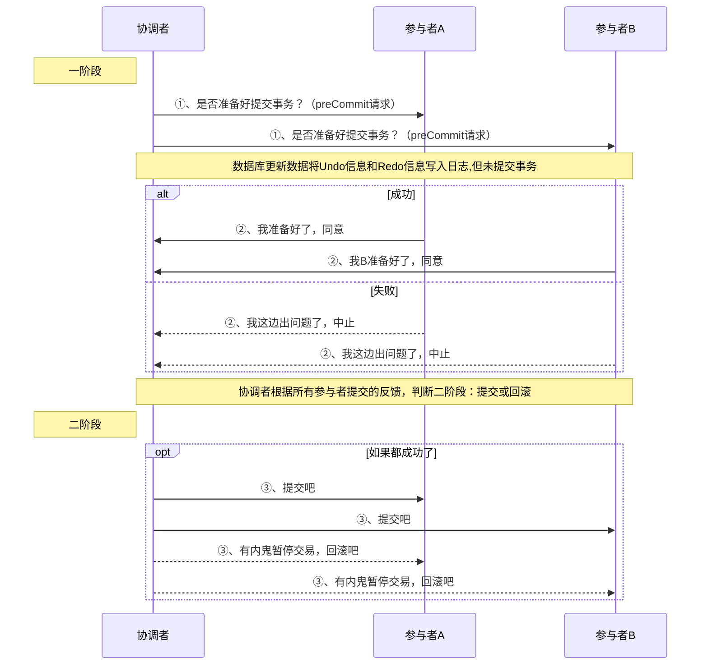
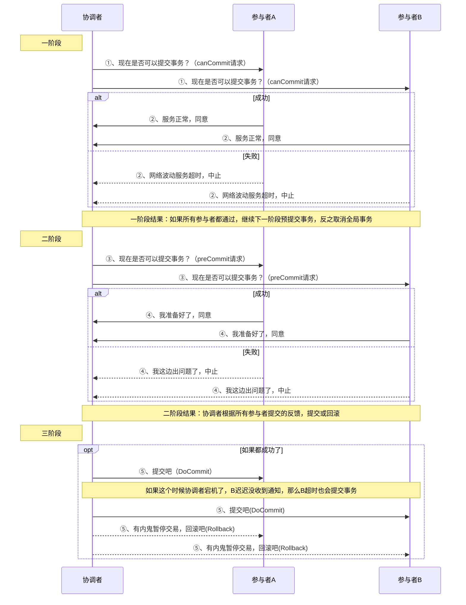
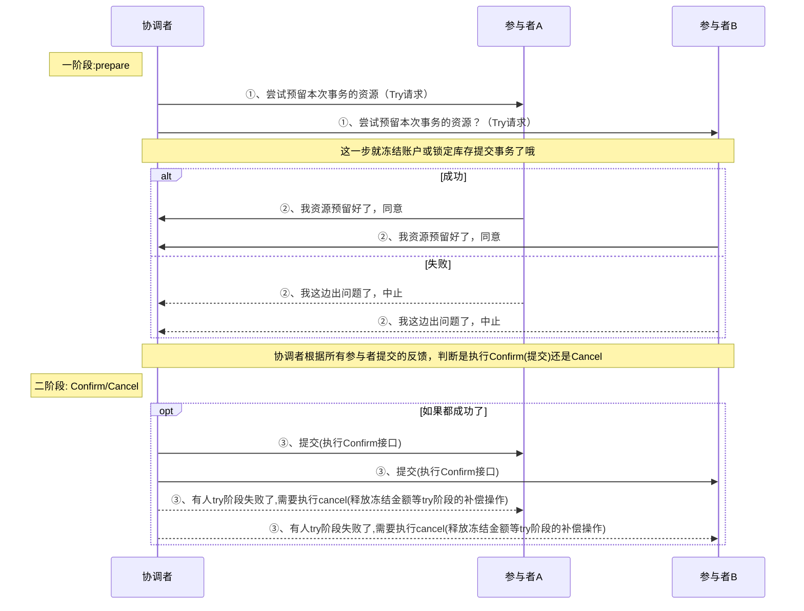

### 一、前言
+ 在讲Seata之前先讲一下本地事务与分布式事务理论
+ 事务指的就是一个操作单元，在这个操作单元中的所有操作最终要保持一致的行为，要么所有操作
都成功，要么所有的操作都被撤销。简单地说，事务提供一种 “要么什么都不做，要么做全套” 的机制。


#### 1、本地事务
+ 本地事务其实可以认为是数据库提供的事务机制。
+ 说到数据库事务就不得不说，数据库事务中的**四大特性:ACID**
	+ **A：原子性(Atomicity)**，一个事务中的所有操作，要么全部完成，要么全部不完成
	+ **C：一致性(Consistency)**，在一个事务执行之前和执行之后数据库都必须处于一致性状态
	+ **I：隔离性(Isolation)**，在并发环境中，当不同的事务同时操作相同的数据时，事务之间互不影响
	+ **D：持久性(Durability)**，指的是只要事务成功结束，它对数据库所做的更新就必须永久的保存下来
+ 数据库事务在实现时会将一次事务涉及的所有操作全部纳入到一个不可分割的执行单元，
+ 该执行单元中的所有操作要么都成功，要么都失败，只要其中任一操作执行失败，都将导致整个事务的回滚

#### 2、分布式事务
+ 分布式事务指事务的参与者、支持事务的服务器、资源服务器以及事务管理器分别位于不同的分布式系统的不同节点之上。
+ 简单的说，就是一次大的操作由不同的小操作组成，这些小的操作分布在不同的服务器上，且属于不同的应用，
+ 分布式事务需要保证这些小操作要么全部成功，要么全部失败。本质上来说，分布式事务就是为了保证不同数据库的数据一致性。

#### 3、分布式理论
+ 在分布式事务中，事务的ACID原则难以满足，所以出现了解决分布式事务的理论方法，如下
+ 分布式系统的经典理论：CAP理论 与BASE理论

##### ①、CAP理论
+ CAP 定理（CAP theorem）又被称作布鲁尔定理（Brewer's theorem）。
+ 是加州大学伯克利分校的计算机科学家埃里克·布鲁尔（Eric Brewer）在2000年的`ACM PODC`上提出的一个猜想。
+ 2002年，麻省理工学院的赛斯·吉尔伯特（Seth Gilbert）和南希·林奇（Nancy Lynch）发表了布鲁尔猜想的证明，使之成为分布式计算领域公认的一个定理。
+ 是 `Consistency`、`Availablity`和`Partition-tolerance`的缩写。
	+ ***一致性（Consistency）：*** 即更新操作成功并返回客户端完成后， 所有节点在同一时间的数据完全一致，这里的一致性是指的强一致性，一般关系型数据库就有强一致性特性。。
	+ ***可用性（Availablity）：*** 即服务一直可用，而且是正常响应时间。
	+ ***分区容忍性（Partition-torlerance）：*** 在网络分区的情况下，被分隔的节点仍能正常对外服务


***CAP权衡：***

|选择|说明|
|--|--|
|CA|放弃分区容错性，加强一致性和可用性，其实就是传统的单机数据库的选择。放弃P的同时也就意味着放弃了系统的扩展性，也就是分布式节点受限，没办法部署子节点，这是违背分布式系统设计的初衷的。|
|AP|放弃一致性（这里说的一致性是强一致性），追求分区容错性和可用性，这是很多分布式系统设计时的选择，例如很多NoSQL系统就是如此|
|CP|放弃可用性，追求一致性和分区容错性，基本不会选择，网络问题会直接让整个系统不可用|

***总结：***
+ CAP理论，我们知道无法同时满足一致性、可用性和分区容错性这三个特性。
+ CAP理论告诉我们分布式系统只能选择`CP`或者`AP`,因为放弃P那就不是分布式系统了，所以一般都会根据业务在C和A之间寻求平衡。。

##### ②、BASE理论
+ eBay的架构师`Dan Pritchett`源于对大规模分布式系统的实践总结，在ACM上发表文章提出`BASE理论`，BASE理论是对CAP理论的延伸。
+ BASE是指基本可用（Basically Available）、软状态（Soft State）、最终一致性（ Eventual Consistency）
+ 核心思想是即使无法做到强一致性，但应用可以采用适合的方式达到最终一致性（Eventual Consitency）
+ 每一个应用都可以根据自身的业务特点，采用适当的方式达到最终一致性。

***基本可用(Basically Available)***
+ 基本可用指分布式系统在出现不可预知的故障时候，允许损失部分可用性，保证核心服务可用。
+ 比如电商大促时，为了应对访问量激增，部分用户可能会被引导到降级页面，服务熔断限流

***软状态（Soft State）***
+ 简单的说就是不同节点的数据副本之间进行数据同步的过程存在延时，这个延时不影响可用性。
+ 例如一次写操作只更新了一个结点就返回成功。那么其他节点和这个节点的数据时不一致的。
+ 此时的数据状态就是软状态。

***最终一致性（ Eventual Consistency）***
+ 指最终数据要实现一致性，例如：软状态的数据最终我们要通过一些手段将数据同步到其他数据节点上。
+ 弱一致性和强一致性相反，最终一致性是弱一致性的一种特殊情况。

**BASE与ACID**
+ 总的来说，BASE理论面向的是大型高可用可扩展的分布式系统，和传统的事物ACID特性是相反的，
+ 它完全不同于ACID的强一致性模型，而是通过牺牲强一致性 来获得可用性。
+ 并允许数据在一段时间内是不一致的，但最终达到一致状态。
+ 但同时，在实际的分布式场景中，不同业务单元和组件对数据一致性的要求是不同的。
+ 因此在具体的分布式系统架构设计过程中，ACID特性和BASE理论往往又会结合在一起。


#### 4、DTP分布式事务模型
+ 在分布式系统中，每一个机器节点虽然都能够明确的直到自己在进行事务操作中的结果时成功或失败，但却无法直接获取其他分布式节点的操作结果。
+ 因此，当一个事务操作需要跨越多个分布式节点的时候，为了保持事务处理的ACID特性。就需要用到分布式事务。
+ DTP 全称 `Distributed Transaction Processing Reference`是X/Open这个组织定义出的一套分布式事务标准。
+ 主要包含以下角色：
    + *AP(Application Program)：* 也就是应用程序，可以理解为使用DTP的程序
    + *RM(Resource Manager)：* 资源管理器，一般是数据库，也可以是其他的资源管理器，如消息队列(如JMS数据源)，文件系统等
    + *TM(Transaction Manager)：* 事务管理器，管理全局事务，协调事务的提交或者回滚，并协调故障恢复。
+ 在该模型中，一个分布式事务（全局事务）可以被拆分成多个本地事务，运行在不同的AP和RM上，每个本地事务的ACID很好实现，但是全局事务必须保证每个事务要么都成功要么都失败


**DTP的重要概念：**
+ ***事务：*** 一个事务是一个完整的工作单元，由多个独立的计算任务组成，这多个任务在逻辑上是原子的。
+ ***全局事务：*** 对于一次性操作多个资源管理器的事务，就是全局事务
+ ***分支事务：*** 在全局事务中，某一个资源管理器有自己独立的任务，这些任务的集合作为这个资源管理器的分支任务
+ ***控制线程：*** 用来表示一个工作线程，主要是关联AP,TM,RM三者的一个线程，也就是事务上下文环境。简单的说，就是需要标识一个全局事务以及分支事务的关系。


**XA规范：**
+ XA是DTP模型定义TM和RM之间通讯的接口规范。
+ TM用它来通知数据库事务的开始、结束、提交、回滚。基于XA规范衍生出下面的二阶段提交（2PC）、三阶段提交（3PC）。
+ `JTA(Java Transaction API)`仅定义了接口，它是XA协议的JAVA实现。
+ *其中JTA有几个重要的接口：*
    + `javax.transaction.TransactionManager:`
        高层的事务管理器接口，供应用服务器使用,事务管理器承担着所有事务参与单元者的相互通讯的责任。
    + `javax.transaction.UserTransaction:`
        高层的应用事务划分接口，供客户程序使用,给应用程序提供了编程控制事务边界的能力。如开启提交回滚事务
    + `javax.transaction.xa.XAResource:`
        `X/Open XA`协议的标准Java映射，供事务性资源管理器使用。
    + `javax.transaction.Xid:`
        Xid 接口是 X/Open 事务标识符XID结构的Java映射。此接口指定三个存取方法，以检索全局事务格式ID、全局事务ID和分支限定符。Xid 接口供事务管理器和资源管理器使用。此接口对应用程序不可见。


**常见的分布式事务的处理方案：2PC、3PC、TCC、Saga、**

#### 5、2PC
+ `Two Phase Commit`,顾名思义，二阶段提交的意思。
+ 在分布式系统中，每个节点虽然可以知晓自己的操作时成功或者失败，却无法知道其他节点的操作的成功或失败。
+ 当一个事务跨越多个节点时，为了保持事务的ACID特性，
+ 需要引入一个作为协调者的组件来统一掌控所有节点（称作参与者）的操作结果并最终指示这些节点是否要把操作结果进行真正的提交（比如将更新后的数据写入磁盘等等）。
+ 因此，二阶段提交的算法思路可以概括为： 参与者将操作成败通知协调者，再由协调者根据所有参与者的反馈情报决定各参与者是否要提交操作还是中止操作。
+ 第一阶段(提交请求阶段) ； 第二阶段(提交执行阶段)。


**大致流程如下：**



##### 第一阶段(提交准备阶段)
+ 协调者节点向所有参与者节点询问是否可以执行提交操作，并开始等待各参与者节点的响应。
+ 参与者节点执行询问发起的所有事务操作，并将Undo信息和Redo信息写入日志。
+ 各参与者节点响应协调者节点发起的询问。如果参与者节点的事务操作实际执行成功，则它返回一个"同意"消息；如果参与者节点的事务操作实际执行失败，则它返回一个"中止"消息

***有时候，第一阶段也被称作投票阶段，即各参与者投票是否要继续接下来的提交操作。***

##### 第二阶段(提交执行阶段)
+ 第二阶段根据第一阶段会分为：成功或失败两种情况

***成功***
当协调者节点从所有参与者节点获得的响应消息都为"同意"时：
+ 协调者节点向所有参与者节点发出"正式提交"的请求。
+ 参与者节点正式完成操作，并释放在整个事务期间内占用的资源。
+ 参与者节点向协调者节点发送"完成"消息。
+ 协调者节点收到所有参与者节点反馈的"完成"消息后，完成事务。

***失败***
如果任一参与者节点在第一阶段返回的响应消息为"终止"，或者协调者节点在第一阶段的询问超时之前无法获取所有参与者节点的响应消息时：
+ 协调者节点向所有参与者节点发出"回滚操作"的请求。
+ 参与者节点利用之前写入的Undo信息执行回滚，并释放在整个事务期间内占用的资源。
+ 参与者节点向协调者节点发送"回滚完成"消息。
+ 协调者节点收到所有参与者节点反馈的"回滚完成"消息后，取消事务。

**缺点：**
+ ***同步阻塞：*** 事务执行过程中所有参与者都是阻塞型的，第三方参与者访问参与者占有的资源时会被阻塞；
+ ***单点故障：*** 协调者一旦发生故障，参与者会被阻塞。尤其在提交阶段，所有参与者都处于锁定资源状态中，无法完成事务操作；（可以选择新的协调者，但无法解决参与者被阻塞的问题）；
+ ***数据不一致：*** 提交阶段协调者向参与者发送commit信息，发生局部网络故障，会导致部分存在参与者未收到commit信息无法提交事务情况，导致出现数据不一致现象；


#### 6、3PC
+ `Three-phase commit`,顾名思义，三阶段提交的意思。
+ 三阶段提交是为解决两阶段提交协议的缺点而设计的。
+ 2PC中只有协调者有超时机制，在第二阶段事务提交时，协调者等待参与者反馈超时，会中断事务，因此被认为“保守”
+ 三阶段提交是“非阻塞”协议。三阶段提交是把二阶段的一阶段拆成了两个步骤先询问是否可以执行事务。
+ 这样三阶段提交就变成 `CanCommit`（发送预提交请求）、`PreCommit`(事务预提交)、`DoCommit`(事务提交) 三个阶段




**如下：**
+ 第一阶段：
    + 询问阶段，协调者向所有的参与者发送一个包含事务内容的CanCommit请求，参与者向协调者反馈事务询问的响应（超时终止）
+ 第二阶段：
    + 预提交阶段，
    + 在一阶段都通过后，协调者向所有的参与者发送preCommit请求，
    + 参与者接收到preCommit请求后，会执行事务操作，并将Undo和Redo信息记录到事务日志中
    + 各参与者向协调者反馈事务执行的响应，等待最终的指令（提交或中断），
+ 第三阶段：
    + 提交阶段，
    + 当二阶段都通过后，发起commit请求，如果有一个节点失败，则发送中止请求
    + 当发送commit请求时协调者宕机了，部分参与者没收到请求超时也是会提交的，会出现数据不一致（如果最终发送的是中止请求的话）

**3PC与2PC主要的不同：**
+ 3PC把2PC的一阶段分成两个阶段，CanCommit和PreCommit，然后加上超时机制
+ 3pc在协调者、参与者中都加入了超时判断机制，2pc只有协调者有。
+ 避免资源锁定太久导致浪费。但是3PC同样存在着很多问题。实现起来非常复杂，因为很难通过多次询问来解决系统间分歧问题，
+ 尤其是存在超时状态互不信任的分布式网络中，这也就是著名的拜占庭将军问题

*除了2PC与3PC,还有一种类似的分布式事务解决方案，那就是TCC*

#### 7、TCC
+ TCC即为`Try(资源预留) Confirm(事务提交) Cancel(取消事务)`，它属于补偿型分布式事务。
+ **Try：** 预留业务资源,先把多个应用中的业务资源预留和锁定住，为后续的确认打下基础，如：冻结资产锁定库存
+ **Confirm：** 确认执行业务操作，在Try操作中涉及的所有应用均成功之后进行确认，操作预留的业务资源和Commit类似
+ **Cancel：** 取消执行业务操作，当Try操作中涉及的所有应用没有全部成功，需要将已成功的应用进行取消 (即Rollback回滚)。其中Confirm和Cancel操作是一对反向业务操作。



*是不是感觉和2PC很像,它们之间的异同*

**与2PC的相同点：**
+ 两者整体都是 两阶段提交 的模型
+ 一阶段并不真正的执行业务，二阶段根据一阶段的结果进行确认或者取消。
+ 所以两种外观上很相似

**与2PC的不同点：**
+ ①、2PC和3PC都是数据库层面的操作，对于开发人员无感知；而TCC是业务层的操作，对开发人员来说具有较高的开发成本。
	+ 比如2PC的一阶段是prepare事务，也就是预提交事务但是对资源的更新并没有执行(记录再日志文件等待二阶段提交或回滚)，开发者对资源都是单一的更新操作
	+ 而TCC,它的一阶段是资源预留阶段，开发者需要从业务方面来考虑如何把资源预留出来。
	+ 比如：现在A有100元，给B转账20元，那么我们需要把20元这个资源预留出来，不给其他的事务使用，所以一阶段Try要把A账户冻结20元。可用余额变为80元.
	+ 如果二阶段是Confirm的话，就把A冻结置为0，然后给B的账户加上20元。如果二阶段是Cancel,那就释放A的冻结数量到余额即可。
	+ 所以TCC需要开发者去实现`Try`、`Confirm`、`Cancel` 这3个接口,代码侵入性强
+ ②、TCC使用了加锁粒度较小的柔性事务（保证了最终一致性，并没有遵循ACID的原则包在一个大的事务中整体进行原子性的提交。而是变成各自独立应用处理的小事务分开处理。因此也无法保证在同一时刻各个数据源的数据是对应的（强一致性））。
	+ 而2PC属于强一致性的事务，在一个大的事务中要么都成功要么都回滚。

**TCC的优点：**
+ TCC异步高性能，它采用了try先检查，然后异步实现confirm，真正提交的是在confirm方法中。
+ 代码侵入性高既是优点也是缺点，优点就是灵活，缺点就是耦合性高。

**TCC的缺点：**
+ 应用侵入性强：TCC由于基于在业务层面，至使每个操作都需要有 try、confirm、cancel三个接口。
+ 开发难度大：代码开发量很大，要保证数据一致性 confirm 和 cancel 接口还必须实现幂等性，防止空回滚 等等问题。


#### 8、Saga
+ Saga是分布式事务领域的解决方案之一，最初出现在1987年Hector Garcaa-Molrna & Kenneth Salem发表的论文SAGAS里。
+ Saga是由一系列的本地事务构成。每一个本地事务在更新完数据库之后，会发布一条消息或者一个事件来触发Saga中的下一个本地事务的执行。
+ 如果一个本地事务因为某些业务规则无法满足而失败，Saga会执行在这个失败的事务之前成功提交的所有事务的补偿操作。
+ Saga和Tcc有点类似，但Tcc的第一个阶段是预留资源，而Saga是直接对数据进行了扣除/增加


### 二、Seata 是什么?
+ 前面的分布式相关知识介绍完了，现在来讲本文的重点Seata。
+ Seata 意为：`Simple Extensible Autonomous Transaction Architecture` 是一款开源的分布式事务解决方案，致力于提供高性能和简单易用的分布式事务服务。
+ Seata 将为用户提供了 AT（默认）、TCC、SAGA 和 XA 事务模式，为用户打造一站式的分布式解决方案。


#### 1、Seata术语
+ **TC (Transaction Coordinator) - 事务协调者**
维护全局和分支事务的状态，驱动全局事务提交或回滚。
相当于 `seata-server`
+ **TM (Transaction Manager) - 事务管理器**
定义全局事务的范围：开始全局事务、提交或回滚全局事务。
相当于我们开启全局事务的发起方 `@GlobalTransactional`
+ **RM (Resource Manager) - 资源管理器**
管理分支事务处理的资源，与TC交谈以注册分支事务和报告分支事务的状态，并驱动分支事务提交或回滚。
相当于我们的本地事务，：`@Transactional`

***和前面讲的DTP分布式事务模型类似***

#### 2、AT模式
+ AT模式是seata默认的模式
##### 使用前提
+ 基于支持本地 ACID 事务的关系型数据库。
+ Java 应用，通过 JDBC 访问数据库。

##### 事务机制
+ 基于2PC阶段的演变
+ 一阶段：业务数据和回滚日志记录在同一个本地事务中提交，释放本地锁和连接资源。
+ 二阶段：
	+ 提交异步化，非常快速地完成。
	+ 回滚通过一阶段的回滚日志进行反向补偿。

#### 工作机制
+ 由TM全局事务发起者，向TC发起全局事务请求，会返回全局事务XID
+ 一阶段：
	+ ①、解析SQL，得到SQL类型、操作的表、SQL条件等相关信息
	+ ②、根据解析得到的条件信息，生成查询语句，得到数据更新前的数据（查询的时候使用 `for update` 行锁）
	+ ③、执行业务 SQL：更新记录
	+ ④、查询更新后的数据镜像：根据前镜像的结果，通过主键定位数据。
	+ ⑤、把前后镜像数据以及业务 SQL 相关的信息组成一条回滚日志记录，插入到 UNDO_LOG 表中。
	+ ⑥、提交前，向TC注册分支事务，返回 BranchID
	+ ⑦、本地事务提交：业务数据的更新和前面步骤中生成的 UNDO LOG 一并提交
	+ ⑧、将本地事务提交的结果上报给TC。
+ 二阶段：
	+ **提交：**
	+ ①、收到 TC 的分支提交请求，把请求放入一个异步任务的队列中，马上返回提交成功的结果给 TC
	+ ②、异步任务阶段的分支提交请求将异步和批量地删除相应 UNDO LOG 记录。
	+ **回滚**
	+ ①、收到 TC 的分支回滚请求，开启一个本地事务，执行如下操作
	+ ②、通过 XID 和 BranchID 查找到相应的 UNDO LOG 记录。
	+ ③、数据校验：拿 UNDO LOG 中的更新后镜像与当前数据进行比较，不一致的不能回滚，证明被其他线程修改了数据
	+ ④、根据 UNDO LOG 中的前镜像和业务 SQL 的相关信息生成并执行回滚的语句。
	+ ⑤、提交本地事务。并把本地事务的执行结果（即分支事务回滚的结果）上报给 TC。


### 三、Seata快速开始
+ 理论啥的讲完了，实战开始吧

#### 1、安装Seata
+ 也就是充当协调者的角色，TC服务
+ 下载地址：[http://seata.io/zh-cn/blog/download.html](http://seata.io/zh-cn/blog/download.html)
+ 或者去Github下载，地址：[https://github.com/seata/seata/releases](https://github.com/seata/seata/releases)
+ 通过上面链接下载可执行的压缩包后，解压。
+ 之后修改根目录下的conf目录下的`file.conf`和`registry.conf` 这两个文件
+ file.conf选择TC的数据存储方式，有：file、db(支持数据库：`mysql/oracle/postgresql/h2/oceanbase`)、redis
+ registry.conf选择注册中心和配置中心
+ 选择哪种模式就修改对应模式的配置即可，我这里file.conf选择的是数据库mode,register.conf选择的是nacos

**seata数据库的SQL脚本如下：**
```sql
-- ----------------------------
-- Table structure for branch_table
-- ----------------------------
DROP TABLE IF EXISTS `branch_table`;
CREATE TABLE `branch_table`  (
  `branch_id` bigint(20) NOT NULL,
  `xid` varchar(128) CHARACTER SET utf8 COLLATE utf8_general_ci NOT NULL,
  `transaction_id` bigint(20) NULL DEFAULT NULL,
  `resource_group_id` varchar(32) CHARACTER SET utf8 COLLATE utf8_general_ci NULL DEFAULT NULL,
  `resource_id` varchar(256) CHARACTER SET utf8 COLLATE utf8_general_ci NULL DEFAULT NULL,
  `branch_type` varchar(8) CHARACTER SET utf8 COLLATE utf8_general_ci NULL DEFAULT NULL,
  `status` tinyint(4) NULL DEFAULT NULL,
  `client_id` varchar(64) CHARACTER SET utf8 COLLATE utf8_general_ci NULL DEFAULT NULL,
  `application_data` varchar(2000) CHARACTER SET utf8 COLLATE utf8_general_ci NULL DEFAULT NULL,
  `gmt_create` datetime NULL DEFAULT NULL,
  `gmt_modified` datetime NULL DEFAULT NULL,
  PRIMARY KEY (`branch_id`) USING BTREE,
  INDEX `idx_xid`(`xid`) USING BTREE
) ENGINE = InnoDB CHARACTER SET = utf8 COLLATE = utf8_general_ci ROW_FORMAT = Dynamic;

-- ----------------------------
-- Records of branch_table
-- ----------------------------

-- ----------------------------
-- Table structure for global_table
-- ----------------------------
DROP TABLE IF EXISTS `global_table`;
CREATE TABLE `global_table`  (
  `xid` varchar(128) CHARACTER SET utf8 COLLATE utf8_general_ci NOT NULL,
  `transaction_id` bigint(20) NULL DEFAULT NULL,
  `status` tinyint(4) NOT NULL,
  `application_id` varchar(32) CHARACTER SET utf8 COLLATE utf8_general_ci NULL DEFAULT NULL,
  `transaction_service_group` varchar(32) CHARACTER SET utf8 COLLATE utf8_general_ci NULL DEFAULT NULL,
  `transaction_name` varchar(128) CHARACTER SET utf8 COLLATE utf8_general_ci NULL DEFAULT NULL,
  `timeout` int(11) NULL DEFAULT NULL,
  `begin_time` bigint(20) NULL DEFAULT NULL,
  `application_data` varchar(2000) CHARACTER SET utf8 COLLATE utf8_general_ci NULL DEFAULT NULL,
  `gmt_create` datetime NULL DEFAULT NULL,
  `gmt_modified` datetime NULL DEFAULT NULL,
  PRIMARY KEY (`xid`) USING BTREE,
  INDEX `idx_gmt_modified_status`(`gmt_modified`, `status`) USING BTREE,
  INDEX `idx_transaction_id`(`transaction_id`) USING BTREE
) ENGINE = InnoDB CHARACTER SET = utf8 COLLATE = utf8_general_ci ROW_FORMAT = Dynamic;

-- ----------------------------
-- Records of global_table
-- ----------------------------

-- ----------------------------
-- Table structure for lock_table
-- ----------------------------
DROP TABLE IF EXISTS `lock_table`;
CREATE TABLE `lock_table`  (
  `row_key` varchar(128) CHARACTER SET utf8 COLLATE utf8_general_ci NOT NULL,
  `xid` varchar(96) CHARACTER SET utf8 COLLATE utf8_general_ci NULL DEFAULT NULL,
  `transaction_id` bigint(20) NULL DEFAULT NULL,
  `branch_id` bigint(20) NOT NULL,
  `resource_id` varchar(256) CHARACTER SET utf8 COLLATE utf8_general_ci NULL DEFAULT NULL,
  `table_name` varchar(32) CHARACTER SET utf8 COLLATE utf8_general_ci NULL DEFAULT NULL,
  `pk` varchar(36) CHARACTER SET utf8 COLLATE utf8_general_ci NULL DEFAULT NULL,
  `gmt_create` datetime NULL DEFAULT NULL,
  `gmt_modified` datetime NULL DEFAULT NULL,
  PRIMARY KEY (`row_key`) USING BTREE,
  INDEX `idx_branch_id`(`branch_id`) USING BTREE
) ENGINE = InnoDB CHARACTER SET = utf8 COLLATE = utf8_general_ci ROW_FORMAT = Dynamic;
```

+ 这里以Windows版本启动示例，修改上面配置之后，双击：`bin/seata-server.bat` 文件即可
+ 因为我这里配置的是nacos,所以先要把nacos启动起来。


#### 2、导入依赖
+ 导入依赖有三种方式：
+ ①、`seata-all` 这个是seata相关包，需要自己实现像数据源代理、xid传递，初始化GlobalTransactionScanner等
+ ②、`seata-spring-boot-starter` 这个是和Springboot整合了,内置`GlobalTransactionScanner`自动初始化功能，若外部实现初始化，请参考`SeataAutoConfiguration`保证依赖加载顺序。里面引用了`seata-all`
+ ③、`spring-cloud-alibaba-seata` 这个和spirngcloud-alibaba整合，内部引用了`seata-spring-boot-starter`

**推荐用法：**
```xml
<dependency>
	<groupId>com.alibaba.cloud</groupId>
	<artifactId>spring-cloud-alibaba-seata</artifactId>
	<version>${alibaba.seata.version}</version>
	<exclusions>
		<exclusion>
			<groupId>io.seata</groupId>
			<artifactId>seata-spring-boot-starter</artifactId>
		</exclusion>
		<exclusion>
			<artifactId>seata-all</artifactId>
			<groupId>io.seata</groupId>
		</exclusion>
	</exclusions>
</dependency>
<dependency>
	<groupId>io.seata</groupId>
	<artifactId>seata-spring-boot-starter</artifactId>
	<version>${最新版}</version>
</dependency>
```

> 参考：[http://seata.io/zh-cn/docs/ops/deploy-guide-beginner.html](http://seata.io/zh-cn/docs/ops/deploy-guide-beginner.html)


#### 3、添加配置
+ 我这里暂时不用配置中心来读取配置，全部放到配置文件中
+ 如下：

```yml
spring:
  profiles:
    active: dev
  application:
    name: seata-user
  cloud:
    nacos:
      discovery:
        server-addr: 127.0.0.1:8848
        username: nacos
        password: nacos

# 下面这个就是seata的所有配置文件了
seata:
  enabled: true
  application-id: ${spring.application.name}
  tx-service-group: ${spring.application.name}-group
  enable-auto-data-source-proxy: true
  use-jdk-proxy: false
#  config:
#    type: nacos
#    nacos:
#      username: nacos
#      password: nacos
#      server-addr: 127.0.0.1:8848
#      group: SEATA_GROUP
#      namespace: 94455b2a-cf66-40b5-819b-bba352aaa4f1
  registry:
    type: nacos
    nacos:
      username: nacos
      password: nacos
      server-addr: 127.0.0.1:8848
      application: seata-server
      namespace: 94455b2a-cf66-40b5-819b-bba352aaa4f1
  client:
    rm:
      async-commit-buffer-limit: 10000
      report-retry-count: 5
      table-meta-check-enable: false
      report-success-enable: false
      saga-branch-register-enable: false
      saga-json-parser: fastjson
      lock:
        retry-interval: 10
        retry-times: 30
        retry-policy-branch-rollback-on-conflict: true
    tm:
      commit-retry-count: 5
      rollback-retry-count: 5
      default-global-transaction-timeout: 60000
      degrade-check: false
      degrade-check-period: 2000
      degrade-check-allow-times: 10
    undo:
        data-validation: true
        log-serialization: jackson
        log-table: undo_log
        only-care-update-columns: true
  service:
    vgroup-mapping:
      seata-user-group: default
    disable-global-transaction: false
    enable-degrade: false
    grouplist:
      default: 127.0.0.1:8091
  transport:
    shutdown:
      wait: 3
    thread-factory:
      boss-thread-prefix: NettyBoss
      worker-thread-prefix: NettyServerNIOWorker
      server-executor-thread-prefix: NettyServerBizHandler
      share-boss-worker: false
      client-selector-thread-prefix: NettyClientSelector
      client-selector-thread-size: 1
      client-worker-thread-prefix: NettyClientWorkerThread
      worker-thread-size: default
      boss-thread-size: 1
    type: TCP
    server: NIO
    heartbeat: true
    serialization: seata
    compressor: none
    enable-client-batch-send-request: true
  log:
    exception-rate: 100
```

+ 事务组名要一致，然后按照需求自己修改配置
+ 参数配置详解请看官方文档：[http://seata.io/zh-cn/docs/user/configurations.html](http://seata.io/zh-cn/docs/user/configurations.html)


#### 4、业务代码实现
+ 每个业务服务的数据都要添加undo_log表，保存一阶段数据

```sql
CREATE TABLE `undo_log` (
  `id` bigint(20) NOT NULL AUTO_INCREMENT COMMENT 'increment id',
  `branch_id` bigint(20) NOT NULL COMMENT 'branch transaction id',
  `xid` varchar(100) NOT NULL COMMENT 'global transaction id',
  `context` varchar(128) NOT NULL COMMENT 'undo_log context,such as serialization',
  `rollback_info` longblob NOT NULL COMMENT 'rollback info',
  `log_status` int(11) NOT NULL COMMENT '0:normal status,1:defense status',
  `log_created` datetime NOT NULL COMMENT 'create datetime',
  `log_modified` datetime NOT NULL COMMENT 'modify datetime',
  PRIMARY KEY (`id`),
  UNIQUE KEY `ux_undo_log` (`xid`,`branch_id`)
) ENGINE=InnoDB AUTO_INCREMENT=169 DEFAULT CHARSET=utf8 COMMENT='AT transaction mode undo table';
```

+ 上面都准备好之后，只需要在需要发起全局事务的service添加 `@GlobalTransactional` 即可

**①、常规用法：**

```java
    @Override
    @Transactional
    @GlobalTransactional(rollbackFor = Exception.class)
    public Result payOrder(PayDto dto) {
        log.info("全局事务xid={}", RootContext.getXID());
        // todo ....
        return Result.ok();
    }
```


**②、try-catch的回滚方法**
+ 通过`try-catch` 主动触发全局事务回滚操作

```java
@Override
    @GlobalTransactional(rollbackFor = Exception.class)
    public Result payOrder2(PayDto dto) throws TransactionException {
        try{
            log.info("全局事务xid={}", RootContext.getXID());
            // todo ...
            return Result.ok();
        }catch (Exception e){
            // 这个方法可以回滚全局事务
            GlobalTransactionContext.reload(RootContext.getXID()).rollback();
            return Result.error(ApiResultEnum.FEIGN_ERROR);
        }
    }
```

**③、某些服务不走全局事务**
+ 相同一个业务中，调用了3个服务，但是其中1个服务可以让其不走全局事务（失败就失败，不管它，它不受全局事务管理）

```java
@GlobalTransactional(rollbackFor = Exception.class)
public Result payOrder3(PayDto dto) {
	log.info("全局事务xid={}", RootContext.getXID());
	// todo ...

	/**
	 * 扣除库存这里不走全局事务，如果失败，照样进行
	 */
	// 解绑全局事务ID,不受全局事务影响，报错也不会回滚
	String unbind = RootContext.unbind();
	try{
		// todo ...
		// 这里的操作是不受全局事务管理的，失败或成功都不影响
	}catch (Exception e){
		log.error(e.getMessage(),e);
	}finally {
		if(!StringUtils.isEmpty(unbind)){
			// 重新绑定全局事务，下面全局事务会生效
			RootContext.bind(unbind);
		}
	}
	// todo ...
	return Result.ok();
}
```

+ 如上 扣除库存 这个操作就不受全局事务管理，不管它是失败还是成功，都不会对全局事务有任何影响。
+ 调用：`RootContext.unbind()` 解绑事务，和绑定事务：`RootContext.bind(unbind)`


### 四、seata使用配置中心
+ 如上的配置是写在配置文件的，没法动态修改
+ 可以把配置写到配置中心,这样可以动态修改
+ 这里以nacos为例，访问：[https://github.com/seata/seata/tree/develop/script/config-center](https://github.com/seata/seata/tree/develop/script/config-center)
+ 下载添加到nacos配置中心脚本:`nacos-config.sh`：[https://github.com/seata/seata/blob/develop/script/config-center/nacos/nacos-config.sh](https://github.com/seata/seata/blob/develop/script/config-center/nacos/nacos-config.sh)
+ 然后下载示例的配置文件: `config.txt`: [https://github.com/seata/seata/blob/develop/script/config-center/config.txt](https://github.com/seata/seata/blob/develop/script/config-center/config.txt)
+ **把下载下来的脚本nacos-config.sh 放到seata的conf目录下，把config.txt 放到seata的根目录下。**
+ 执行命令如下：

```bash
# -h nacos的ip -p nacos端口 -g nacos配置文件的组 -t 你的namespace号(若是public可省略此选项) -u nacos用户名 -w nacos密码
sh nacos-config.sh -h localhost -p 8848 -g SEATA_GROUP -t 94455b2a-cf66-40b5-819b-bba352aaa4f1 -u nacos -w nacos
```


#### 1、修改YML配置文件
+ 这样之后yml配置文件就只需写注册中心配合配置中心配置即可

```yml
seata:
  enabled: true
  application-id: seata-user
  tx-service-group: seata-user-group
  enable-auto-data-source-proxy: true
  use-jdk-proxy: false
  config:
    type: nacos
    nacos:
      username: nacos
      password: nacos
      server-addr: 127.0.0.1:8848
      group: SEATA_USER_GROUP
      namespace: 94455b2a-cf66-40b5-819b-bba352aaa4f1
  registry:
    type: nacos
    nacos:
      username: nacos
      password: nacos
      server-addr: 127.0.0.1:8848
      application: seata-server
      namespace: 94455b2a-cf66-40b5-819b-bba352aaa4f1
```


#### 2、本文全部代码
+ ***Github:*** [https://github.com/rstyro/SpringCloud-Alibaba-learning/tree/main/springcloud-seata](https://github.com/rstyro/SpringCloud-Alibaba-learning/tree/main/springcloud-seata)
+ ***Gitee:*** [https://gitee.com/rstyro/SpringCloud-Alibaba-learning/tree/main/springcloud-seata](https://gitee.com/rstyro/SpringCloud-Alibaba-learning/tree/main/springcloud-seata)


